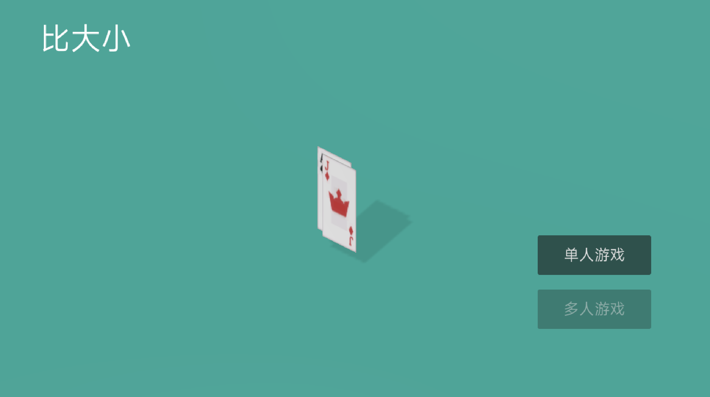
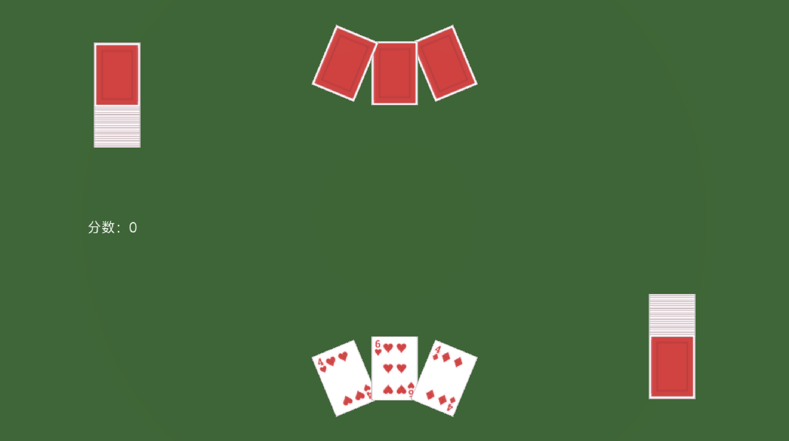

# 51Games

低配版《世界游戏大全51》

## 编译

使用 Godot Editor 4.2 编译，无需 Mono 环境。

## 游戏列表

1. 比大小

## 开源协议

- [Card3D](https://godotengine.org/asset-library/asset/3031) is licensed under the MIT License

除上述资产属于它们的作者或其作者指定的许可证外， 51Games 的其余资产或代码均基于 [WTFPL 许可证](LICENSE) 授权。